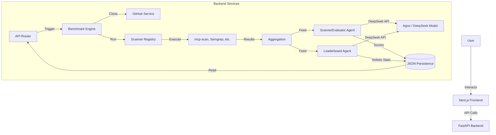

# MCP Scanner Benchmark & Evaluation System

A comprehensive framework for executing, evaluating, and benchmarking security scanners for the Model Context Protocol (MCP). This system uses an Agentic AI approach to analyze scan results, score tools based on performance, and maintain a holistic leaderboard.

## Architecture

The project consists of a **FastAPI Backend** that orchestrates scans and AI evaluations, and a **Next.js Frontend** for visualization and control.



## Key Features

- **Multi-Scanner Orchestration**: Runs multiple open-source MCP security scanners in parallel (mcp-scan, mcp-shield, etc.).
- **AI-Driven Evaluation**: Uses **DeepSeek** (via Agno) to review findings, assign percentage scores, and determine confidence levels.
- **Holistic Leaderboard**: Tracks long-term scanner performance across multiple benchmarks using a moving average system.
- **Dual-Mode Analysis**: Supports both **Static Analysis** (code review) and **Dynamic Fuzzing** (endpoint probing).
- **Comparative UI**: A rich dashboard to view individual reports, compare tool outputs, and track global rankings.

## Setup & installation

### Prerequisites
- Docker & Docker Compose
- DeepSeek API Key

### Quick Start (Docker)

1. **Clone the repository**:
   ```bash
   git clone <repo-url>
   cd mcp-scanner-benchmark
   ```

2. **Configure Environment**:
   Create a `.env` file in the root directory:
   ```env
   DEEPSEEK_API_KEY=your_deepseek_key_here
   GITHUB_TOKEN=your_github_token_here  # Optional, for higher rate limits
   ```

3. **Run with Docker Compose**:
   ```bash
   docker compose up --build
   ```

4. **Access the application**:
   - Frontend: [http://localhost:3000](http://localhost:3000)
   - Backend API Docs: [http://localhost:8000/docs](http://localhost:8000/docs)

### Local Development

#### Backend
```bash
cd backend
python3 -m venv .venv
source .venv/bin/activate
uv sync
uv run uvicorn main:app --reload --port 8000
```

#### Frontend
```bash
cd frontend
npm install
npm run dev
```

## Usage

1. **Start a Benchmark**: Go to the dashboard, enter a GitHub repository URL (e.g., `https://github.com/modelcontextprotocol/servers`), and click "Start Analysis".
2. **View Reports**: Click on a completed scan to see the detailed AI evaluation, winner, and raw findings.
3. **Check Leaderboard**: Navigate to the "Leaderboard" tab to see which scanners are performing best overall.

## Project Structure

See the detailed walkthroughs for deep dives into the code:
- [Backend Walkthrough](BACKEND_WALKTHROUGH.md) (Not in repo by default)
- [Frontend Walkthrough](FRONTEND_WALKTHROUGH.md) (Not in repo by default)
